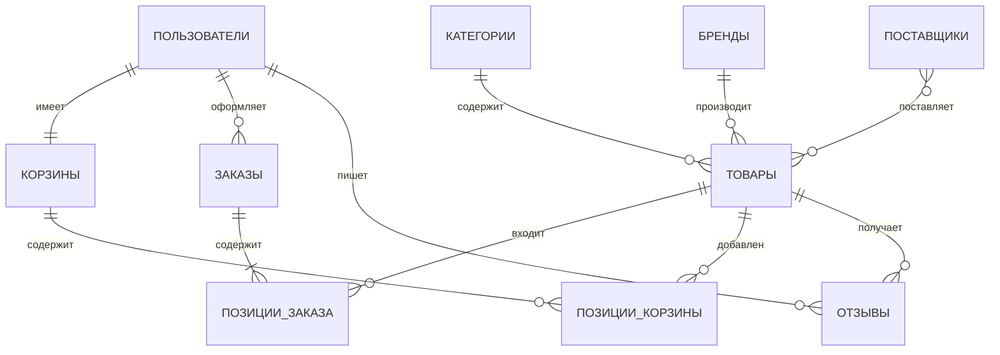
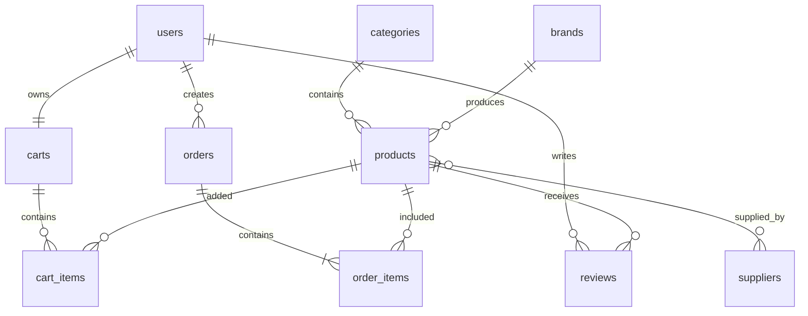

# Модель данных

## Инфологическая схема

```mermaid
erDiagram
    ПОЛЬЗОВАТЕЛИ ||--|| КОРЗИНЫ : имеет
    ПОЛЬЗОВАТЕЛИ ||--o{ ЗАКАЗЫ : оформляет
    ПОЛЬЗОВАТЕЛИ ||--o{ ОТЗЫВЫ : пишет
    КАТЕГОРИИ ||--o{ ТОВАРЫ : содержит
    БРЕНДЫ ||--o{ ТОВАРЫ : производит
    ПОСТАВЩИКИ }o--o{ ТОВАРЫ : поставляет
    ЗАКАЗЫ ||--|{ ПОЗИЦИИ_ЗАКАЗА : содержит
    ТОВАРЫ ||--o{ ПОЗИЦИИ_ЗАКАЗА : входит
    КОРЗИНЫ ||--o{ ПОЗИЦИИ_КОРЗИНЫ : содержит
    ТОВАРЫ ||--o{ ПОЗИЦИИ_КОРЗИНЫ : добавлен
    ТОВАРЫ ||--o{ ОТЗЫВЫ : получает
```

## Даталогическая схема

```mermaid
erDiagram
    users ||--|| carts : owns
    users ||--o{ orders : creates
    users ||--o{ reviews : writes
    categories ||--o{ products : contains
    brands ||--o{ products : produces
    products }o--o{ suppliers : supplied_by
    orders ||--|{ order_items : contains
    products ||--o{ order_items : included
    carts ||--o{ cart_items : contains
    products ||--o{ cart_items : added
    products ||--o{ reviews : receives
```
